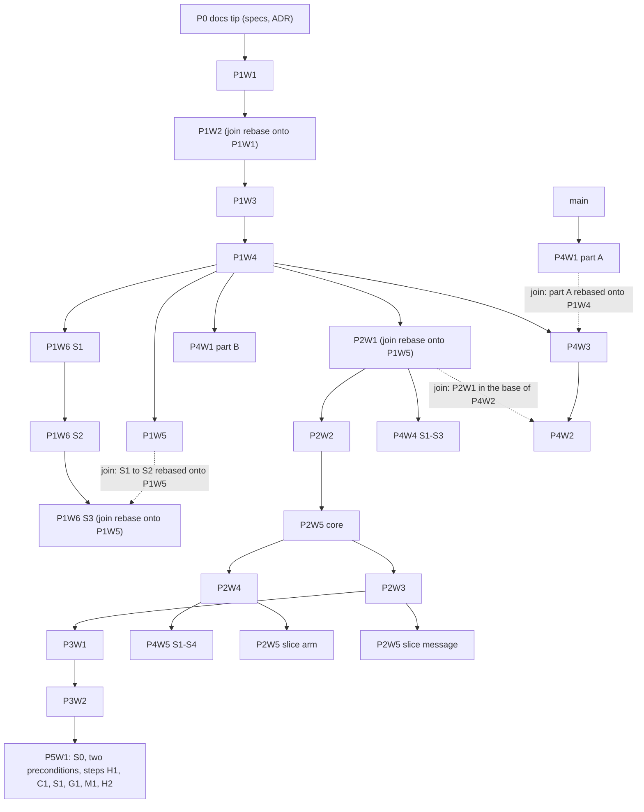

# T389 — Harnu mod: master implementation plan

**Status:** ready to execute · **Date:** 2026-10-02 · **Epic:** T389
**Specs:** [`docs/specs/T389-companion-mod/`](../../specs/T389-companion-mod/00-master.md) (the master spec, the contract and nineteen wave specs; all reviewed) · **ADR:** [ADR-0018](../../adr/0018-harnu-mod-as-integration-substrate.md)
**Phase plans:** [`P1-sensor.md`](P1-sensor.md) · [`P2-actuator.md`](P2-actuator.md) · [`P3-approval.md`](P3-approval.md) · [`P4-surface-and-governance.md`](P4-surface-and-governance.md) · [`P5-retirement.md`](P5-retirement.md)

This plan turns the specs into branches, batches and boot packets. It cites requirement ids (`SEC-*`, `ARB-*`, `MOD-*`, `QA-*`, `DOC-*`) and acceptance criteria (`AC-P1W3-4`) instead of restating them. Where this plan and a spec disagree about _what to build_, the spec wins. Where they disagree about _order or branching_, this plan wins (it resolves a base-branch conflict in master §5, see §3.2).

## 1. Goal

Ship `harnu-companion` (the "Harnu mod") so Harnu reads identity, fleet state, usage and approvals from inside each `claude` process and carries a closed set of commands back, with every legacy seam kept as a permanent fallback. Nothing goes `active` without its parity gate (ARB-6c). Nothing is deleted (ARB-8).

## 2. How the plans are used

- **One wave = one branch = one PR.** Slices exist only where a spec slices the wave: P1W6 (S1 to S3), P2W5 (core and two per-verb slices), P4W1 (parts A and B), P4W4 (S1 to S3), P4W5 (S1 to S4), P5W1 (S0, two preconditions and six steps, one branch each).
- **Executors** are separate Claude sessions (Sonnet by default), one per worktree, one boot packet each (found in the phase plans). A boot packet is complete: the executor reads the packet, the spec and its plan section, nothing else.
- **GitHub Actions is unavailable.** The merge bar is `scripts/ci/local-pipeline.sh --base <branch below>` (§9). An executor never waits for CI and never merges.
- **Stacking.** Sequential units stack: base = the branch below, PR against it. Nobody waits for a merge. When a base merges, the child is retargeted with `git rebase --onto main <old-base> <branch>` and the pipeline is re-run.
- **Branch names:** `feat/t389-p
w<w>-<slug>`, slices add `-s<n>` (P4W1 uses `-a` and `-b`, P2W5 per-verb slices use `-arm` and `-message`). Flip PRs use `feat/t389-p
w<w>-flip-<family>`. P5W1 uses `feat/t389-p5w1-<id>` (ids in §3.3).
- **Worktrees.** `EnterWorktree` skips `WORKTREE.md`, so every executor runs `npm ci` first and `npm run typecheck` as the smoke check. One mutating verifier per worktree; never bare `git stash` (shared stack).

## 3. Delivery graph

### 3.1 Stack (PR base of each branch)

Dotted edges are **join rebases**: the child needs two parents, so the executor starts from the first parent and rebases the second under it before the child's PR opens (master §5 already does this for P1W2 and P2W1). Join rebases only touch disjoint files; expected conflicts are limited to `register.ts`, `contract.ts`, `api-surface.json`, `en.json`, `pt-BR.json`, `design.md`, `CHANGELOG.md` and `docs/user/*`.

### 3.2 Resolution of the base-branch conflict in master §5

The master §5 table gives one base per wave, but four waves need two parents "in base" (P4W3 needs P1W4 and P4W1 part A; P4W2 needs P4W3 and P2W1; P1W6 S3 needs S2 and P1W5; P2W5's slices need the core and P2W3 or P2W4). This plan keeps every master base as the **start base** and adds an explicit **join** for the second parent. It also puts P2W5 core between P2W2 and the P2W3/P2W4 fan-out, so both per-verb slices have the core in their ancestry. If the core is late, P2W3 and P2W4 still start from P2W2; the core is rebased under both before their PRs open.

### 3.3 Per-wave bases

| Wave          | Branch                                                                                  | Start base                                                     | Join before the PR opens                                                                                                                                                                                     |
| ------------- | --------------------------------------------------------------------------------------- | -------------------------------------------------------------- | ------------------------------------------------------------------------------------------------------------------------------------------------------------------------------------------------------------ |
| P1W1          | `feat/t389-p1w1-host-server`                                                            | P0 docs tip                                                    | none                                                                                                                                                                                                         |
| P1W2          | `feat/t389-p1w2-mod-skeleton`                                                           | P0 docs tip                                                    | rebase onto P1W1 before P1W3 starts; drop the local stub                                                                                                                                                     |
| P1W3          | `feat/t389-p1w3-handshake-identity`                                                     | P1W2 (with P1W1 below)                                         | none                                                                                                                                                                                                         |
| P1W4          | `feat/t389-p1w4-arbitration-rollout`                                                    | P1W3                                                           | none                                                                                                                                                                                                         |
| P1W5          | `feat/t389-p1w5-fleet-state`                                                            | P1W4                                                           | none                                                                                                                                                                                                         |
| P1W6 S1       | `feat/t389-p1w6-telemetry-usage-s1`                                                     | P1W4                                                           | rebase the S1 to S2 chain onto P1W5 before S3 starts                                                                                                                                                         |
| P1W6 S2       | `…-s2`                                                                                  | S1                                                             | as above                                                                                                                                                                                                     |
| P1W6 S3       | `…-s3`                                                                                  | S2 (rebased onto P1W5)                                         | none                                                                                                                                                                                                         |
| P4W1 A        | `feat/t389-p4w1-mods-tab-a`                                                             | `main`                                                         | none if it merged first (merge order 1); otherwise rebase onto P1W4 before P4W3 starts                                                                                                                       |
| P4W1 B        | `feat/t389-p4w1-mods-tab-b`                                                             | P1W4 (with part A below)                                       | none (part A is rebased onto P1W4 by the P4W3 executor, or by the part B executor if it starts first)                                                                                                        |
| P4W3          | `feat/t389-p4w3-outside-harnu`                                                          | P1W4                                                           | part A rebased under it                                                                                                                                                                                      |
| P2W1          | `feat/t389-p2w1-command-channel`                                                        | P1W4                                                           | rebase onto P1W5 before P2W2 starts                                                                                                                                                                          |
| P2W2          | `feat/t389-p2w2-start-prompt`                                                           | P2W1                                                           | none                                                                                                                                                                                                         |
| P2W5 core     | `feat/t389-p2w5-mcp-attribution`                                                        | P1W5                                                           | rebase onto P2W2 once P2W2's PR is open                                                                                                                                                                      |
| P2W3          | `feat/t389-p2w3-messaging`                                                              | P2W2 (then P2W5 core)                                          | core rebased under it; from then on the branch below is the core: open the PR against it and run the pipeline with `--base feat/t389-p2w5-mcp-attribution`                                                   |
| P2W4          | `feat/t389-p2w4-live-context-guard`                                                     | P2W2 (then P2W5 core)                                          | core rebased under it; same `--base` rule as P2W3                                                                                                                                                            |
| P4W4 S1       | `feat/t389-p4w4-resume-plan-s1`                                                         | P2W1 or P2W2                                                   | P1W6 S3 must be in its ancestry: after the P1 merges retarget the P2 chain onto `main` (§1) and check `git merge-base --is-ancestor` on the S3 tip before starting                                           |
| P4W4 S2, S3   | `…-s2`, `…-s3`                                                                          | the slice below                                                | none                                                                                                                                                                                                         |
| P4W2          | `feat/t389-p4w2-band-commands`                                                          | P4W3 if it is still an open PR, else the P2W1 tip              | the other parent: if P4W3 is open, rebase it onto the P2W1 tip first; if P4W3 is already in `main` (merge order 3 comes before P2W1 at 5), the P2W1 chain has been retargeted onto `main` and so contains it |
| P3W1          | `feat/t389-p3w1-approval-hold`                                                          | P2W3                                                           | none                                                                                                                                                                                                         |
| P4W5 S1       | `feat/t389-p4w5-compaction-digest-s1`                                                   | P2W4                                                           | P1W6 must be in its ancestry (same check as P4W4 S1)                                                                                                                                                         |
| P4W5 S2 to S4 | `…-s2`, `…-s3`, `…-s4`                                                                  | the slice below                                                | none                                                                                                                                                                                                         |
| P2W5 arm      | `feat/t389-p2w5-mcp-attribution-arm`                                                    | P2W4                                                           | none                                                                                                                                                                                                         |
| P2W5 message  | `feat/t389-p2w5-mcp-attribution-message`                                                | P2W3                                                           | none                                                                                                                                                                                                         |
| P3W2          | `feat/t389-p3w2-sentinel`                                                               | P3W1                                                           | none                                                                                                                                                                                                         |
| P5W1 step     | `feat/t389-p5w1-<id>` (S0, pre-blob-events, pre-guard-registry, h1, c1, s1, g1, m1, h2) | S0 on the P3W2 tip or `main`; each next step on the one before | the step's family flip must be in `main`                                                                                                                                                                     |

## 4. The waves

Size rule: **S** up to 15 acceptance criteria, **M** 16 to 30, **L** 31 or more, or any wave delivered in four or more PRs. The ACs column is the spec's count, with human and live-verify ACs in brackets. Rollout state is the state at the **merge of the wave PR**; a flip to `active` is a separate PR (§7).

| Wave | Size | ACs (human / live)                   | Docs the PR must touch                                                                                                                                       | Rollout state at merge                                                                  |
| ---- | ---- | ------------------------------------ | ------------------------------------------------------------------------------------------------------------------------------------------------------------ | --------------------------------------------------------------------------------------- |
| P1W1 | L    | 36 (0 / 2)                           | `docs/dev/live-verify-second-instance.md`; label `no-changelog`                                                                                              | dark: mode `off`, nothing listens                                                       |
| P1W2 | L    | 31 (0 / 3)                           | new `docs/dev/companion-mod.md`; `local-ci` skill; T200 status line; smoke addendum; labels `no-changelog,no-user-docs`                                      | dark: mode `off`; `mod` step and `--with-cli` exist                                     |
| P1W3 | L    | 49 (1 / 8)                           | lesson `synthetic-sessions/004`; smoke addendum; `no-changelog`                                                                                              | `identity` declared; default still `off` until P1W4                                     |
| P1W4 | L    | 31 (3 / 4)                           | CHANGELOG; `docs/user` settings, system-monitor, troubleshooting; `design.md`; 27 `harnuMod.*` keys in both locales                                          | default flips `off` to **shadow** for every family (OD-1), behind disclosure + switch   |
| P1W5 | M    | 27 (0 / 4)                           | `docs/user` troubleshooting, sessions; `no-changelog` until the flip                                                                                         | `taskState` shadow                                                                      |
| P1W6 | L    | 32 (0 / 4), 3 PRs                    | `docs/user/usage.md`, `settings.md` (S1 adds a top-level main file); `no-changelog` until the flip                                                           | `telemetry`, `planUsage` shadow; calibration off until its gate                         |
| P2W1 | L    | 40 (1 / 6)                           | CHANGELOG; `docs/user` system-monitor, troubleshooting; `design.md` §6; 4 keys; `api-surface.json`                                                           | `channel` key `shadow` (observe-only commands)                                          |
| P2W2 | L    | 32 (0 / 7)                           | `docs/user` sessions, troubleshooting; `api-surface.json`; CHANGELOG at the flip                                                                             | `startPrompt` shadow: no claim registered, paste gate delivers                          |
| P2W3 | L    | 36 (0 / 8)                           | CHANGELOG; `harnu-features.md` + marker; `tool-catalog.ts` text; `docs/user` agent-control, approval-inbox; T215 status line                                 | `message` shadow: socket delivers; audit sensor reports                                 |
| P2W4 | L    | 32 (1 / 3)                           | CHANGELOG; `harnu-features.md` + marker; `docs/user` agent-control, sessions; `design.md` §6; 2 `orchestrator.*` keys                                        | `guard` shadow (observe-only `guard.set`); `context` key on but needs `channel: active` |
| P2W5 | M    | 25 (0 / 3), 3 PRs                    | CHANGELOG; `harnu-features.md` + marker; `docs/user/agent-control.md`; `design.md` §6; 3 `mcpServer.audit.*` keys; ADR-0013 line                             | `stamp` key `off`; flips to `observe` on its own evidence (§7)                          |
| P3W1 | L    | 39 (2 / 7)                           | CHANGELOG; `harnu-features.md` + marker; `docs/user` approval-inbox, troubleshooting; `docs/hook-bridge-integration.md`; `design.md`; `approvalInbox.*` keys | `approval` shadow: the mod asks, the host releases, the bridge decides                  |
| P3W2 | M    | 29 (1 / 1)                           | `docs/user/approval-inbox.md`; `design.md` §6; CHANGELOG at the engine flip                                                                                  | `sentinel` key `regex` (today's engine)                                                 |
| P4W1 | M    | 23 (1 / 2), 2 PRs                    | CHANGELOG; new `docs/user/mods.md`, README index, settings, bundled-skills link; `design.md` §6; `CLAUDE.md` map row; `modsAudit.*`                          | A: no flag, read-only. B: `modsLive` `false`                                            |
| P4W2 | M    | 24 (1 / 2)                           | CHANGELOG; `harnu-features.md` + marker; `docs/user` sessions, troubleshooting; `design.md` §6, §8; 3 keys                                                   | `surface` key `false` until AC-P4W2-14 and -15 pass                                     |
| P4W3 | M    | 23 (2 / 3)                           | CHANGELOG; `docs/user` mods, folders-and-worktrees, approval-inbox, troubleshooting; `design.md` §6; keys                                                    | `external` key `false`; install refuses on managed machines (OD-5)                      |
| P4W4 | M    | 27 (1 / 3), 3 PRs                    | CHANGELOG; `docs/user` settings, sessions, usage; `design.md` §6, §8; `hibernationPolicy.plan.*` keys                                                        | `plan` switch off                                                                       |
| P4W5 | L    | 30 (1 / 7), 4 PRs                    | CHANGELOG; `harnu-features.md` + marker; `docs/user` project-memory, sessions, troubleshooting; `design.md`; 6 keys                                          | `recap` switch off; durable rows on with `context`                                      |
| P5W1 | L    | 24 (1 / 7), 9 branches in 7 releases | CHANGELOG; `docs/user` settings, troubleshooting, approval-inbox, usage; rewrite `docs/hook-bridge-integration.md`; `design.md`; keys                        | each step ships in its own release, only on its own evidence                            |

Docs rules that apply to every row (repo `CLAUDE.md`): `design.md` first for UI, tokens only, both locales in the same change, English only, no client identifiers, `~` and `<userData>` in paths, user strings say "Harnu mod", never "companion" (master §15). A new top-level main file or component fires the user-docs gate; an `src/` change fires the CHANGELOG gate, so a wave with no user behaviour carries `no-changelog` (and `no-user-docs` where it adds no surface) and says why in the PR body.

## 5. Batches and the WIP ceiling

Ceiling: **5 concurrent executors**, 4 by default (a rule of this plan: neither the master spec nor the ADR states one). A batch is "who is running at the same time", not a gate; an executor starts as soon as its start base exists.

| Batch | Executors running                                        | Count  | Starts when                                                                                        | Notes                                                                                                                                                        |
| ----- | -------------------------------------------------------- | ------ | -------------------------------------------------------------------------------------------------- | ------------------------------------------------------------------------------------------------------------------------------------------------------------ |
| B0    | P1W1, P1W2, P4W1 part A                                  | 3      | now                                                                                                | P1W2 stubs P1W1's three exports until the join rebase                                                                                                        |
| B1    | P1W3, P4W1 A (tail)                                      | 2      | P1W1 and P1W2 PRs open, join rebase done                                                           | critical path; no other wave has a base yet                                                                                                                  |
| B2    | P1W4, P4W1 A (tail)                                      | 2      | P1W3 PR open                                                                                       | critical path; the managed-machine run (LV-P1W4-e) is scheduled with the operator now                                                                        |
| B3    | P1W5, P1W6 S1 to S2, P2W1 (speculative, §8), P4W3        | 4      | P1W4 PR open                                                                                       | P4W1 B joins as a fifth when a slot frees; the single `git rebase` of P4W1 A onto P1W4 is done by the P4W3 executor, so A's own executor is already finished |
| B4    | P1W6 S3, P4W1 B, flips of the P1 families, **Gate K**    | 1 to 3 | P1W5 PR open; ledger evidence accrues                                                              | the soak is wall-clock time, not executor time                                                                                                               |
| B5    | P2W2, P2W5 core, P4W2, P4W4 S1 to S3                     | 4      | Gate K passed; the P2W1 and P4W3 PRs exist (stack on their tips; their merges are not awaited, §1) | P4W2 needs P4W3 and P2W1 in its base (§3.3); P4W4 starts from P2W1 with P1W6 in its ancestry                                                                 |
| B6    | P2W3, P2W4, P4W4 (continuing), P2W5 core (finishing)     | 4      | P2W2 PR open                                                                                       | P2W3 and P2W4 touch different seams                                                                                                                          |
| B7    | P3W1, P4W5 S1 to S4, P2W5 arm, P2W5 message, P4W4 (tail) | 4 to 5 | P2W3 and P2W4 PRs open                                                                             | `register.ts` is the only shared file; five only when P4W2 and P2W5 core have finished, otherwise hold the P2W5 message slice until a slot frees             |
| B8    | P3W2, flips of the P2 and P3 families                    | 1 to 2 | P3W1 PR open; ledgers fill                                                                         |                                                                                                                                                              |
| B9    | P5W1, one step at a time                                 | 1      | a family's flip is in `main` and its soak elapsed                                                  | each step in its own release (spec §13)                                                                                                                      |

## 6. Merge order

Merges are bottom-up and happen as soon as a PR's bar is green and its delivery verification passes (§12). A merge is the operator's decision; the executor never merges.

1. P4W1 A (from `main`, independent; merge first).
2. P1W1, P1W2, P1W3, P1W4, P1W5.
3. P1W6 S1, S2, S3; P4W1 B; P4W3.
4. Flip PRs of the P1 families as their gates pass (§7). **Gate K** (§10).
5. P2W1, P2W2, P2W5 core.
6. P2W3, P2W4, P4W2, P4W4 S1 to S3.
7. P3W1, P4W5 S1 to S4, P2W5 arm, P2W5 message.
8. P3W2.
9. Flip PRs of the P2 and P3 families as their gates pass.
10. P5W1 steps, in the order H1, C1, S1, G1, M1, H2, one per release.

P1 is fully in `main` before any P2 wave merges (Gate K). That also makes every later join trivial: P1W6, P4W1 and P4W3 are ancestors of everything in P2 and beyond.

## 7. Parity-ledger milestones: when a family flips to `active`

A flip is its own small PR: one change to `DEFAULT_FAMILY_MODE` (or a per-folder ramp first, then the default), the `gateStatus` report attached, the CHANGELOG entry the spec names, and the operator's confirmation recorded in the PR body (ARB-6c, ARB-6d). Thresholds are the specs'; do not edit them in the PR.

| Family or key                                     | Owner wave                     | Gate to `active` (cited from the spec's §13)                                                                                                                                                                       |
| ------------------------------------------------- | ------------------------------ | ------------------------------------------------------------------------------------------------------------------------------------------------------------------------------------------------------------------ |
| `identity`                                        | P1W3                           | 200 consecutive spawned sessions (30 each of new, fork, agent; 20 clear), zero unexplained mismatch, bind rate at least 97 %, hello p95 under 2 000 ms, LV-P1W3-c/-d/-e green, AC-P1W3-41 signed, fork id answered |
| `taskState`                                       | P1W5                           | 200 sessions, 5 000 legacy transitions, zero unexplained; corpus of 20 approved, 10 declined, 10 Esc, 20 subagent runs, 5 `/clear`                                                                                 |
| `telemetry`                                       | P1W6                           | 500 paired samples over 50 sessions, zero unexplained; calibration: 100 covered sessions within 1 %, factors in the 0.5 to 2 range                                                                                 |
| `planUsage`                                       | P1W6                           | 200 comparisons over 7 days including one five-hour reset, zero unexplained                                                                                                                                        |
| `channel` key                                     | P2W1                           | 50 interactive sessions over 3 folders, 5 000 polls, zero hard-cap aborts, zero double parks, 99.5 % of `flush` within TTL                                                                                         |
| `startPrompt`                                     | P2W2                           | shadow: 40 paste-path spawns, hello inside the wait in 95 %; active on ramped folders: 40 deliveries with zero double submit and zero undelivered; AC-P2W2-19 and -24                                              |
| `message`                                         | P2W3                           | shadow: 30 messages, mode known for 90 % of recipients; active: 30 deliveries, zero `DELIVERY_UNCONFIRMED`; AC-P2W3-25, -26; the bypass concession signed                                                          |
| `guard`                                           | P2W4                           | 200 evaluated calls from 10 armed sessions, zero unexplained (only `stricter-realpath`), AC-P2W4-21, LV-P2W4-a and -b                                                                                              |
| `stamp` key                                       | P2W5                           | `off` to `observe` after LV-P2W5-b and AC-P2W5-21; `observe` to `prefer`: 300 stamped calls, 20 sessions, zero unexplained `bad-mac`, `mismatch`, `replayed`                                                       |
| `approval`                                        | P3W1                           | gate 1 (folder): 200 asks from 15 sessions, every legacy request paired; gate 2 (default): 100 delivered decisions, one hold over 60 s, LV-P3W1-c, OD-2 answered                                                   |
| `sentinel` key                                    | P3W2                           | `regex` to `shadow` on merge; to `structured`: 2 000 Bash calls over 20 sessions, `unparsed` under 1 %, AC-P3W2-21, -22, -23, LV-P3W2-a                                                                            |
| `external` profile                                | P4W3                           | flips with its family only after 10 external sessions with zero unexplained divergences                                                                                                                            |
| `surface`, `modsLive`, `plan`, `recap`, `context` | P4W2, P4W1 B, P4W4, P4W5, P2W4 | per spec §13: `surface` on after AC-P4W2-14 and -15; `modsLive` on after AC-P4W1-16; `plan` and `recap` are operator confirmation points with AC-P4W4-21 and AC-P4W5-24 as inputs                                  |

### P5W1 retirement gate (RG)

Four clauses for every step (spec P5W1 §7.1). A machine that fails RG-a or RG-c keeps the artifact installed; that is a correct outcome.

| Clause | Requirement                                                                                                                                    |
| ------ | ---------------------------------------------------------------------------------------------------------------------------------------------- |
| RG-a   | the family has been `active` for all folders for 30 days with the step's owned-session minimum (H1 200, C1 200, S1 200, G1 50, M1 100, H2 100) |
| RG-b   | the tested ceiling moved at least twice while the family was `active`                                                                          |
| RG-c   | zero unexplained divergences, and every legacy-authoritative session carries a reason from the closed list                                     |
| RG-d   | the reversibility drill passes: companion mode `off` restores the legacy artifact for the next spawned session                                 |

A step never ships in the release that flips its family. The blob gains `StopFailure` one release before H1 and the decision events one release before H2 (R28).

## 8. Operator decisions (recorded)

All six are approved with the defaults the specs implement. Later confirmation points are still the operator's call, at the time shown.

| Id   | Decision                                                  | Recorded answer (default)                                             | Needed before         |
| ---- | --------------------------------------------------------- | --------------------------------------------------------------------- | --------------------- |
| OD-1 | the mod loads by default after P1W4                       | yes: every family `shadow`, behind the disclosure and the kill switch | P1W4 merge            |
| OD-2 | Inbox coverage for sessions the engine does not ask about | hold only when the engine would ask; Sentinel deny preserved          | P3W1 default `active` |
| OD-3 | removing Harnu's entries from the user's settings         | a notice, then automatic removal when the machine's ledger passes RG  | first P5W1 step       |
| OD-4 | is a manifest drain operator-caused for `asUser`          | yes                                                                   | P2W2 flip             |
| OD-5 | outside install on a machine with managed settings        | refuse the install                                                    | P4W3 merge            |
| OD-6 | promote and demote without a restart                      | in place, with a toast                                                | P2W4 merge            |
| OD-K | (added by this plan) speculative P2W1 before Gate K       | allowed: build and open the PR, but merge only after Gate K (§10)     | B3                    |

Pending confirmation points (master §13, recorded here with the same weight): each family flip (§7), the `plan` switch default (P4W4), the `recap` switch default (P4W5), the `message` bypass concession (P2W3), and raising the minimum CLI (P5W1, not before twelve months after 2.1.287). The tested ceiling starts at 2.1.289 (smoke §11) and the minimum CLI stays 2.1.287.

## 9. Definition of done common to every wave

A wave PR is done when **all** of the following hold. The PR body carries the evidence for each; the delivery verifier (§12) re-checks them.

1. **Pipeline.** `scripts/ci/local-pipeline.sh --base <branch below> --json <path>` is green. After P1W2 lands this includes the `mod` step (QA-4); before it, the step does not exist.
2. **Flags.** Add `--with-cli` for any wave with an `integration` or `mod-test` AC or a `tests/cli/*.cli.test.ts` file (every wave from P1W2 on, except where the spec says otherwise: P1W1 needs neither). Add `--with-e2e` for every wave that touches a renderer file (P1W3 through `stores/sessions.ts`, P1W4, P2W1, P2W2, P2W4, P2W5 core, P3W1, P4W1 to P4W5, and P5W1 steps H1, C1, S1, G1 and H2). Pass `--labels` exactly as the PR carries them (`no-changelog`, `no-user-docs`, `no-awareness`).
3. **Evidence per AC.** Every AC id of the wave maps to a named test title, a recipe step or a screenshot. `unit`, `contract`, `mod-test`: the test passes in the pipeline log. `integration`: the `--with-cli` log with `claude --version`. `live-verify`: the recipe log from a second isolated instance, with `claude --version`. `human`: listed apart in the PR body for the Delivery Report. No AC is satisfied by an executor's own statement (QA-1).
4. **Negative paths (QA-2).** The wave's tests include mod absent, blocked by policy, lease lost mid-session, host down, the kill switch off mid-session, and for gates a failure that must not become an allow.
5. **Coverage.** Floors not lowered; a new shell file added to the coverage `exclude` list in `vitest.config.mts` carries a justification and a tested core.
6. **Legacy still green.** The legacy path's existing tests pass without edited assertions (ARB-5, ARB-8).
7. **Docs contracts** (DOC-1 to DOC-9): CHANGELOG entry (or the label with a reason); `docs/harnu-features.md` updated **and its marker bumped** for agent-facing waves (run `/harnu-awareness`); `docs/user/` for user-visible waves; `design.md` before any UI code; both locale files with the same keys under `harnuMod.*` or the existing namespace named in the spec; `01-contract.md`, `contract.ts` and the fixtures in the same change for any wire change (DOC-7).
8. **Hygiene.** English only; no client identifiers (run the two key regexes of `tests/no-client-identifiers.test.ts` over every new doc: avoid tokens shaped like a tracker key, use `_` in sentinel names); no token in a log, trace or fixture (SEC-8); no client or employer directory in any example path (use the neutral vocabulary of the repo `CLAUDE.md`).
9. **Committed.** `git rev-list --count <base>..HEAD` is at least 1 and the tree is clean before the executor reports done (a session can report green gates without committing).

### Executor hygiene (applies to every boot packet)

- Push your branch and open the PR against the branch below, with the evidence in the body (§9). You never merge, never push to `main`, never force-push a branch you did not create, and never change a family mode or a feature-key default to `active` or on: a flip is its own PR with the operator's confirmation (§7), and a packet that says "merge only after the kill-criteria review" or "go only if the gate holds" is a condition the operator checks, not a permission.
- Decide within the spec; do not ask the operator. If a spec defect blocks you, record it in the PR body under "Spec defects" and take the fail-safe reading (the one that keeps legacy authoritative).
- Redirect pipeline output to a file and read the file: a proxy wrapped around shell output can show stale or truncated results, and the file is the ground truth.
- Tests first where the AC method is `unit`, `contract` or `mod-test`: the test file and AC ids are named in the plan step before the code step.
- Mod code: load the `plugin-authoring` skill; never hook a Bash `tool.call` (MOD-3); every hook returns `next(e)` on failure (MOD-2).
- Live-verify recipes use a second isolated instance (`docs/dev/live-verify-second-instance.md`) and tear down only the PIDs you spawned. A recipe that needs a managed machine, a macOS run or a signed-in CLI that is not available is reported as `blocked`, never as a pass.

## 10. Kill criteria and Gate K

ADR-0018 evaluates five criteria **at the end of P1, before any actuator wave is built**. Any one stops the epic at "keep what is additive, build no more". This plan makes the review a named gate.

**Gate K inputs** (collected from the ledger and the PR records; operator signs):

| #   | ADR criterion                                                       | Evidence source                                                                                   |
| --- | ------------------------------------------------------------------- | ------------------------------------------------------------------------------------------------- |
| K1  | bind rate across new, resume, `/clear` and fresh-worktree sessions  | `identity` ledger, bind rate and the per-shape counts (P1W3 §13)                                  |
| K2  | two CLI releases inside the P1 window break the mod                 | a one-line log kept in the PR bodies: `claude --version` of each `mod` step and `--with-cli` run  |
| K3  | the mod implicated in a worker unload or a skipped hook chain       | `bindingCounters`, `legacy / unloaded` states, LV-P1W4-b and -d results, any incident note        |
| K4  | P1 ships and no bug class closed, no legacy path can be demoted     | the `identity` flip merged (BUG-65 class closed) and at least one RG-eligible demotion identified |
| K5  | the ledger disagrees on fleet state or usage in unclassifiable ways | `parityReport` for `taskState`, `telemetry`, `planUsage`: every divergence classified             |

**Allowed before Gate K:** everything in P1, P4W1, P4W3, and P2W1 as an open PR (OD-K). **Not allowed before Gate K:** merging any P2 wave, starting P2W2 or later. If a criterion fails: stop the actuator phases, keep the additive P1 work, and record the decision in project memory.

A hold that drops on hot reload without a recoverable signal cancels P3 alone, not the epic (ADR-0018).

## 11. Risks to the schedule

| #   | Risk                                                                                                                      | Effect                                                            | Mitigation                                                                                                                    |
| --- | ------------------------------------------------------------------------------------------------------------------------- | ----------------------------------------------------------------- | ----------------------------------------------------------------------------------------------------------------------------- |
| S1  | P1W3 is the single-threaded critical path (49 ACs, host, mod and renderer); P1W4 follows it                               | B1 and B2 run at 1 to 2 executors                                 | start P4W1 A early to use the slack; keep P1W3's boot packet strictly to its scope                                            |
| S2  | The soak is wall-clock: 200 identity sessions, 7 days for `planUsage`, 30 days for RG-a. It is gated by real use of Harnu | Gate K and every flip wait on the operator                        | flip the per-folder ramp first on the operator's own folders; keep the ledger running from the P1W4 merge                     |
| S3  | `--with-cli` needs a signed-in CLI; Q5 may make L4 suites `blocked-by-auth`                                               | P1W2 onwards cannot finish its merge bar                          | settle Q5 in P1W2 first (AC-P1W2-16); document a signed-in dedicated config dir; never copy credentials                       |
| S4  | One managed-machine run (Q8, LV-P1W4-e) and one OD-5 run (AC-P4W3-20) need a machine the operator may not have            | two `human` ACs stay open; Q8 answers feed P2W3, P4W2, P4W4, P5W1 | ask for the machine at B2; every dependent wave has a designed fallback and ships without the answer, flips wait for it       |
| S5  | A new CLI release lands mid-epic (R2); the ceiling forces every family to `shadow` until the drift contract passes        | a flip slips; a wave rebases on a new surface                     | the three drift checks (QA-6) run in every pipeline; moving the ceiling is its own PR with `mod` and `--with-cli` logs        |
| S6  | `register.ts` and `contract.ts` are shared by almost every wave; B5 to B7 run four to five executors on them              | rebase conflicts                                                  | MOD-4 (one `on()` per event and matcher), contract §11.4 (shared bodies); each wave adds its own step, never edits another's  |
| S7  | P1W6 S3 and P2W1 both depend on P1W5; a late P1W5 delays both                                                             | B3 stalls                                                         | P1W6 S1 to S2 and P2W1 start from P1W4 and join later                                                                         |
| S8  | Gate K reads the identity flip (K4); a slow soak holds all of P2                                                          | actuator phases wait                                              | OD-K lets P2W1 be built meanwhile; the operator may sign K with identity at ramp rather than default if the gate is met there |
| S9  | A macOS run (OQ-2 of P1W1) is owed before the first family flip                                                           | a flip is blocked                                                 | schedule one run of LV-P1W1-a on macOS before the identity flip                                                               |

## 12. How a delivery verifier grades a wave

Use `harnu:delivery-verifier` on the PR, from the spec's AC list and the PR's evidence, one AC at a time, never from the executor's summary. Record each verdict with `mission_verify_step` when the wave is a Mission step.

| AC method     | Pass requires                                                                                                                                                                                                                                                                                                                               | Fail or `unmet` when                                                  |
| ------------- | ------------------------------------------------------------------------------------------------------------------------------------------------------------------------------------------------------------------------------------------------------------------------------------------------------------------------------------------- | --------------------------------------------------------------------- |
| `unit`        | the test named in `Evidence:` exists in the diff and passed in the pipeline JSON (`step=test`), and it asserts the AC's observable                                                                                                                                                                                                          | the title exists but asserts something weaker, or the test is skipped |
| `contract`    | the golden fixture is committed and both sides replay it (QA-7)                                                                                                                                                                                                                                                                             | only one side runs it                                                 |
| `mod-test`    | the suite passed under the `mod` step with `claude plugin test`, and ends with a positive assertion on an observable effect (QA-7)                                                                                                                                                                                                          | the step was skipped (`--skip mod`) or reported `blocked-by-policy`   |
| `integration` | the `--with-cli` log shows the test ran (no `skipIf`), the debug file has no `hook skipped` or `not loaded`, `claude --version` recorded; an `integration` AC whose `Evidence:` is not under `tests/cli/` (for example `tests/mods-audit-shell.test.ts`) is an ordinary vitest test: it must be in the pipeline JSON `step=test` and passed | skipped for a missing CLI, or the log is absent                       |
| `live-verify` | the recipe's numbered steps were run on a second isolated instance and its log or screenshot is attached with `claude --version`                                                                                                                                                                                                            | "done on the executor's machine" with no artifact                     |
| `human`       | never graded: listed in the Delivery Report as "operator must test", with the screenshot path the spec names                                                                                                                                                                                                                                | n/a                                                                   |

Also checked for every wave: the common definition of done (§9) points 1 to 9; the negative ACs exist (QA-2); the rollout state at merge matches §4; no flip is bundled into a wave PR; the PR touches only the files in the boot packet's scope (a file outside it needs a stated reason). A wave with any unmet non-human AC is `partial`, and its dependants do not start from it without the operator's say.

## 13. Index of the phase plans

| Plan                                                           | Waves                              |
| -------------------------------------------------------------- | ---------------------------------- |
| [`P1-sensor.md`](P1-sensor.md)                                 | P1W1, P1W2, P1W3, P1W4, P1W5, P1W6 |
| [`P2-actuator.md`](P2-actuator.md)                             | P2W1, P2W2, P2W3, P2W4, P2W5       |
| [`P3-approval.md`](P3-approval.md)                             | P3W1, P3W2                         |
| [`P4-surface-and-governance.md`](P4-surface-and-governance.md) | P4W1, P4W2, P4W3, P4W4, P4W5       |
| [`P5-retirement.md`](P5-retirement.md)                         | P5W1                               |
